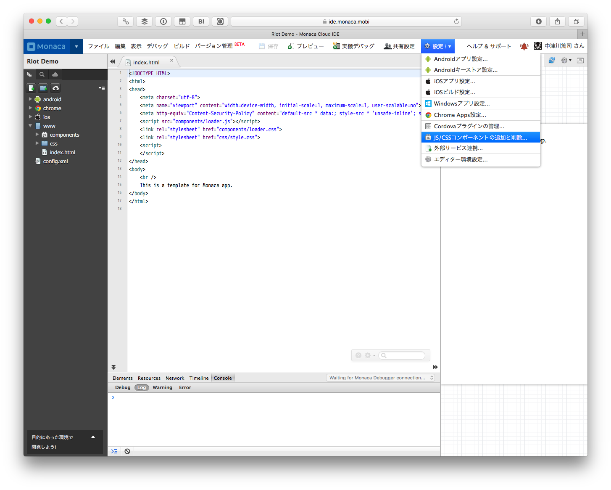
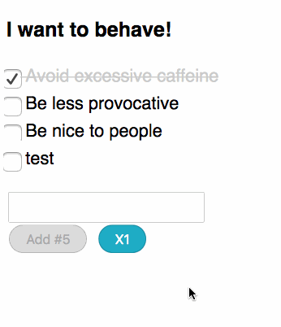

最近はReactが流行です。しかし中にはReactならではのJSXに慣れないという方がいたり、大型であるために速度が思ったよりも出ないと言った悩みを感じている方もいるでしょう。

そんな中、現在注目が集まっているのが[Riot.js](http://riotjs.com/ja/)です。ReactライクにバーチャルDOMが使えるUIライブラリになります。

今回はMonacaと組み合わせて使う方法を紹介します。

### Riot.jsのインストール

Riot.jsはBowerに対応していますので、MonacaのJS/CSSコンポーネントの追加と削除よりインストールできます。



コンポーネントとしてRiot.jsを指定し、ローダーはriot+compiler.min.jsを選択してください。これはRiotの書式を解釈するためのコンパイラが含まれています。

これでRiot.jsのインストールが完了です。

### Todoアプリを試す

ではRiot.jsのチュートリアルにあるTodoアプリを試してみたいと思います。プロジェクトテンプレートはブランクを選んでいます。[CSSファイルをダウンロード]()して、cssフォルダの下にtodo.cssとしてアップロードします。

次に index.html のbodyタグ内を次のように変更します。

```
<body>
    <todo></todo>

    <script src="todo.tag" type="riot/tag"></script>
    <script>
    riot.mount('todo', {
      title: 'I want to behave!',
      items: [
        { title: 'Avoid excessive caffeine', done: true },
        { title: 'Hidden item',  hidden: true },
        { title: 'Be less provocative'  },
        { title: 'Be nice to people' }
      ]
    })
    </script>
</body>
```


内容を見ると分かりますが、todo.tagというファイルを読み込んでいます。これはRiot.jsの提唱するウィジェットという機能で、これがHTML/JavaScriptを一つにパックしたものになります。デザインのベースになるCSSだけは別ファイルになっていますが、tagファイルとCSSファイルによって機能がまとまって提供されます。Web Componentsに近い概念となっていますが、Riot.jsではよりシンプルに実現できるようになっています。

そして、JavaScript側でタグの名前（<todo />）とテンプレートに適用するデータを渡しています。その結果はHTML中の<todo />に対して適用されます。

todo.tagの内容ですが、次のようになります。殆どHTMLと変わりません。その中にJavaScriptが埋め込まれています。

```
<todo>

  <h3>{ opts.title }</h3>

  <ul>
    <li each={ items.filter(whatShow) }>
      <label class={ completed: done }>
        <input type="checkbox" checked={ done } onclick={ parent.toggle }> { title }
      </label>
    </li>
  </ul>

  <form onsubmit={ add }>
    <input name="input" onkeyup={ edit }>
    <button disabled={ !text }>Add #{ items.filter(whatShow).length + 1 }</button>

    <button disabled={ items.filter(onlyDone).length == 0 } onclick={ removeAllDone }>
    X{ items.filter(onlyDone).length } </button>
  </form>

  <!-- this script tag is optional -->
  <script>
    this.items = opts.items

    edit(e) {
      this.text = e.target.value
    }

    add(e) {
      if (this.text) {
        this.items.push({ title: this.text })
        this.text = this.input.value = ''
      }
    }

    removeAllDone(e) {
      this.items = this.items.filter(function(item) {
        return !item.done
      })
    }

    // an two example how to filter items on the list
    whatShow(item) {
      return !item.hidden
    }

    onlyDone(item) {
      return item.done
    }

    toggle(e) {
      var item = e.item
      item.done = !item.done
      return true
    }
  </script>

</todo>
```

実際に動かすと次のようになります。HTMLがテンプレート変数に埋め込まれた状態で表示され、かつJavaScriptのイベントが実行されます。Todo管理するという機能がこのtodo.tagの中にまとまった状態です。



### Riot.jsの特徴

Riot.jsはReactと比較して圧倒的に小さいのが特徴です。Reactの1/5となっています。さらにPolymer + WebComponentsの1/6となっています。Riot.jsは軽量、かつ高速に動作します。ルールもタグの名前を同じにしておく、マウント時にテンプレート変数を渡すなどシンプルなものなのですぐに使い始められるでしょう。

React風にバーチャルDOMが使われていますので描画更新も高速、かつステータスを管理するような必要もありません。描画が高速なのはスマートフォンアプリとして大きなメリットと言えます。ぜひRiot.jsとMonacaを組み合わせてみてください。

[Riot.js — A React-like user interface micro-library · Riot.js](http://riotjs.com/ja/)
